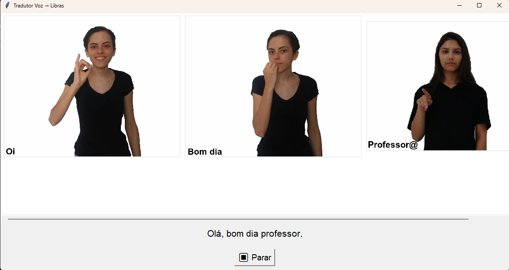

# Tradutor Voz -> Libras

Sistema de tradução em tempo real de voz para Língua Brasileira de Sinais (Libras) usando reconhecimento de fala e animações GIF.

## Descrição

Aplicação desktop que captura áudio continuamente, converte fala em texto e exibe sinais em Libras através de GIFs animados. Desenvolvido como projeto acadêmico da disciplina de Telecomunicações (COE363) - UFRJ.

## Funcionalidades

- **Captura contínua de voz** em tempo real
- **Reconhecimento automático** de fala em português (API Google)
- **Pontuação automática** do texto transcrito
- **Tradução para Libras** com 639 palavras/expressões
- **Animações GIF** sincronizadas e redimensionáveis
- **Suporte a expressões compostas** (ex: "bom dia", "por favor")
- **Interface responsiva** com scroll horizontal automático

## Instalação

```bash
# Instale as dependências
pip install -r requirements.txt

# Execute o programa
python main.py
```

## Dependências

- `SpeechRecognition` - Reconhecimento de voz
- `pyaudio` - Captura de áudio do microfone
- `Pillow` - Processamento de GIFs
- `deepmultilingualpunctuation` - Pontuação automática

## Como Usar

1. Execute `main.py`
2. Clique no botão "Falar"
3. Fale naturalmente em português
4. Os sinais em Libras serão exibidos automaticamente
5. Clique em "Parar" para encerrar a captura

### Exemplo de Uso

**Entrada (voz):** "Oi bom dia professor"

**Saída:** 

## Estrutura do Projeto

```
.
├── main.py                # Código principal
├── dicionario.json        # Mapeamento palavra -> GIF
├── banco_de_dados/        # 639 GIFs de sinais em Libras
└── requirements.txt       # Dependências Python
```

**Nota:** Os GIFs não estão incluídos no repositório devido ao tamanho e ao limite de armazenamento do GitHub.

## Arquitetura

1. **Captura:** Microfone -> áudio
2. **Reconhecimento:** Google Speech API -> texto
3. **Processamento:** Normalização e pontuação
4. **Mapeamento:** Consulta ao `dicionario.json`
5. **Exibição:** Animação de GIFs na interface Tkinter

## Vocabulário

Base de dados com **639 termos**, incluindo:
- Saudações (olá, oi, bom dia, boa tarde, boa noite)
- Palavras comuns (casa, água, comida, família)
- Verbos (comer, dormir, trabalhar, estudar)
- Expressões compostas (por favor, de nada, prazer em te conhecer)

## Requisitos

- Python 3.13+
- Conexão com internet (API Google)
- Microfone funcional

## Equipe

- Ana Beatriz Pinheiro Nunes
- Carlos Henrique Ferreira Brito Filho
- Cristian de Andrade Custodio
- Helena Giovanna Batista da Silva
- Mikaela Rikberg Alves

---

**Obs:** O sistema requer conexão à internet para utilização da API de reconhecimento de voz do Google.